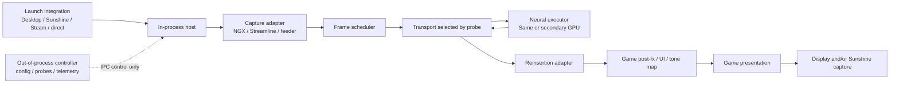

# Portable DLSS execution architecture

Status: portable ABI, policy core, controller, launch frontends, backend registry, and the working Vulkan/Proton backend are implemented. Planned backends are identified explicitly and are not claimed as available.

## 1. Goal and precise portability boundary

The project should insert a neural rendering pass into a game's existing temporal-upscaling pipeline, optionally execute that pass on another NVIDIA GPU, and return the result to the game before its downstream rendering work consumes it. The same package should be usable when a game is launched from a local Linux desktop, a Sunshine application entry, Steam/Proton, or native Windows.

“Any game” cannot mean that every executable can receive temporal DLSS. A temporal DLSS integration needs engine-owned data such as color, depth, motion vectors, jitter, exposure, reset state, and render/output extents. NVIDIA's Streamline guides require the application to tag and supply these resources and constants; Frame Generation and Ray Reconstruction require still more inputs and different pipeline placement ([Streamline programming guide](https://github.com/NVIDIA-RTX/Streamline/blob/main/docs/ProgrammingGuide.md), [DLSS Frame Generation guide](https://github.com/NVIDIA-RTX/Streamline/blob/main/docs/ProgrammingGuideDLSS_G.md), [DLSS Ray Reconstruction guide](https://github.com/NVIDIAGameWorks/Streamline/blob/main/docs/ProgrammingGuideDLSS_RR.md)).

The portable target is therefore:

1. **Temporal integration mode:** games whose NGX, Streamline, FSR 2/3, XeSS, or engine integration exposes a complete and trustworthy frame contract. This is the intended high-quality path.
2. **Final-frame mode:** any game whose completed frame can be captured. This can host spatial enhancement or video processing, but it is a separate mode and must never be described as equivalent to an intended temporal DLSS integration.
3. **Protected-process boundary:** anti-cheat and protected games are supported only through officially permitted injection or plugin mechanisms. The project will not attempt to bypass those controls.

Sunshine is downstream of both modes. It launches the configured command and captures the final display or encoder surface; it does not participate in the game's DLSS resource contract.

## 2. Design rules

- **Capability-driven hardware support.** Never branch on “RTX 3000/4000/5000.” Enumerate adapters, identify them stably, and probe the exact required APIs, extensions, formats, queues, NGX feature creation, model compatibility, external-memory route, and synchronization primitives. A driver/model combination either passes the probe or returns a precise reason.
- **The render adapter owns presentation.** A temporal neural result is normally an intermediate image. It returns to the render adapter so the game can run post-processing, composite UI, tone-map, and present. Direct presentation by the compute adapter belongs only to a separate final-frame backend.
- **Single-GPU and secondary-GPU are policies.** Capture and feature semantics are identical in both cases. The scheduler selects a same-adapter transport or a cross-adapter transport from configuration and measured capability.
- **Stable adapter identity.** Persist GPU UUID and PCI domain:bus:device.function where available. Use DXGI LUID only to correlate APIs within the current Windows/Wine session because it is not durable across boots or Wine environments. Numeric Vulkan, NVML, CUDA, and DXGI indices are discovery-time labels only and must not be stored as persistent identity.
- **API and operating-system code stay at the edges.** The scheduler, frame lifecycle, failure rules, configuration, and telemetry must not contain Vulkan, D3D12, Wine, Sunshine, or game-specific logic.
- **No hidden synchronization.** Every transport reports ownership, signal, wait, deadline, and completion. An adapter must not bury a blocking CPU wait inside a copy operation.
- **Neural-only after bootstrap.** The game-side evaluate may run while the bridge discovers and creates its private session. The first completed private result latches neural-only operation. Later misses repeat a completed neural image or report failure; they never silently execute the original game upscaler. A late result can touch only its own retired frame slot.
- **No game-specific source branches.** Known games use data profiles for matching and narrowly scoped quirks. A new title should normally require a profile or adapter improvement, not another build.
- **Keep launch and capture independent.** Local desktop, Sunshine, and command-line launchers all invoke the same prepared game bundle and configuration.

## 3. System boundary



Only the small host and capture/reinsertion adapter must live in the game process. Configuration, capability discovery, profile resolution, diagnostics, packaging, and telemetry collection can live in an out-of-process controller. Full frame pixels must not travel through controller IPC in temporal mode.

On Proton, the in-process component is a Windows DLL executing inside the game's Wine prefix. It uses the Windows-facing graphics APIs supplied by Proton/DXVK/VKD3D-Proton and the host's Vulkan driver. A native Linux game uses an ELF Vulkan layer or supported engine plugin. Native Windows uses the same Windows DLLs without Wine. Docker is a packaging and launch environment; it cannot remove the requirement for a compatible host NVIDIA kernel/display driver.

## 4. Component model

### 4.1 Controller

The controller performs work that does not belong on the render thread:

- enumerate and correlate adapters across Vulkan, DXGI, NVML, and PCI;
- probe feature/model support separately on each candidate executor GPU;
- probe transport routes in both directions and record bandwidth, latency, alignment, format, and synchronization support;
- resolve global configuration plus a matching game profile;
- create a launch manifest and environment for Desktop, Steam/Proton, Sunshine, or native Windows;
- collect structured logs and expose a compatibility report.

It communicates with the in-process runtime through a versioned local control channel carrying configuration, status, and telemetry. The runtime must also operate from a static resolved configuration when no controller is running.

### 4.2 Host adapters

A host adapter gets code into the process and supplies device, queue, command-buffer/list, module, and lifecycle events. Initial hosts are:

- Vulkan implicit/explicit layer for native Linux, Proton, and Windows Vulkan;
- ReShade add-on for games already using ReShade with add-on support;
- narrowly scoped proxy DLL/IAT hook for Windows or Proton where permitted;
- future official engine/plugin hosts.

The current Vulkan layer, ReShade add-on, and proxy implementations should implement one `HostServicesV1` interface instead of duplicating device and submit tracking.

### 4.3 Capture adapters

A capture adapter recognizes a feature call and produces an API-neutral `FrameContractV1`:

- `ngx_vulkan`: current No Man's Sky path and other Vulkan NGX titles;
- `ngx_d3d12`: native D3D12 NGX calls;
- `streamline_d3d12`: Streamline tags, constants, and feature lifecycle;
- `d3d11_bridge`: D3D11 resources translated through a D3D12 interop layer;
- `temporal_feeder`: FSR/XeSS/engine inputs only when their semantics can be mapped honestly;
- `final_frame`: completed-frame capture with an explicitly different capability class.

Streamline is useful as an integration vocabulary, but it must not be treated as a built-in multi-GPU scheduler. NVIDIA documents that an application may create multiple devices while Streamline itself works with only one device ([programming guide](https://github.com/NVIDIA-RTX/Streamline/blob/main/docs/ProgrammingGuide.md)). A secondary-GPU executor therefore owns its own private NGX/device session.

### 4.4 Scheduler

The scheduler owns the frame state machine, per-viewport sessions, deadlines, back-pressure, failure policy, and resource-generation changes. It depends only on the interfaces below.

```text
Captured -> InputsReady -> Uploading -> Executing -> Downloading
        -> Reinserted -> Retired

Any pre-reinsertion state -> NativeFallback -> Retired
Any invalidated generation -> Abandoned -> Retired
```

Each frame has a monotonic frame ID, session generation, and a dedicated ring slot. A late completion carries the old generation and can never write into a current slot. The ring is configurable and normally contains three or four slots. No global “pending fence” may represent multiple frames.

Deadlines derive from the selected frame budget and measured stage percentiles. They are not fixed multi-second waits. A transient miss falls back for that frame; it does not destroy or rebuild a healthy feature. Resource rebuilds occur only when the contract hash changes, the device is lost, or a backend reports a permanent error.

### 4.5 Executor

An executor owns the API device and the neural feature session on the selected adapter. The first implementation remains `ngx_d3d12`. A later native Vulkan executor can be added without changing capture or scheduling.

The executor must:

- enumerate required extensions, queues, feature levels, model files, and NGX parameters;
- probe actual feature creation and a bounded synthetic evaluation;
- create sessions keyed by executor adapter, feature kind, viewport, resource contract hash, model identity, and quality policy;
- submit asynchronously and expose GPU timestamps around upload, evaluate, and output copy;
- report recoverable frame errors separately from permanent session/device errors.

DLSS Super Resolution/Neural Rendering, Ray Reconstruction, and Frame Generation are distinct feature kinds. They must not share an assumed resource contract. The current bridge must advertise Frame Generation as unavailable because its private second evaluate and in-frame wait do not preserve FG's present/evaluate bookkeeping. A future FG backend needs ownership of the tagged present path and UI/HUD resources before that capability can be enabled.

### 4.6 Transport

The transport moves typed resources between the render and executor adapters. It exposes routes rather than a boolean “multi-GPU” flag:

1. `same_adapter_external_image`: current shared image route; preferred when render and executor identities match.
2. `host_ring_import`: portable discrete-GPU fallback. A ring of page-aligned host allocations is imported or opened by both APIs, with directional buffers and explicit ownership. This removes the extra game-adapter D3D12 helper copy when Vulkan can import the host allocation directly.
3. `d3d12_cross_adapter`: native D3D12 shared cross-adapter heaps/resources where the runtime supports the required restrictions.
4. `peer_device_memory`: future route, enabled only when the topology and APIs prove bidirectional peer access and synchronization.
5. `cpu_staging`: diagnostic last resort, never selected automatically for interactive play unless it meets the latency policy.

D3D12 cross-adapter resources are constrained and use system-memory semantics; they require explicit cross-adapter heap/resource flags and synchronization ([Microsoft shared heaps](https://learn.microsoft.com/en-us/windows/win32/direct3d12/shared-heaps), [heterogeneous multi-adapter sample](https://learn.microsoft.com/en-us/samples/microsoft/directx-graphics-samples/d3d12-heterogeneous-multiadapter-sample-win32/)). Vulkan host-allocation import has strict pointer lifetime, alignment, allocation-size, and explicit synchronization requirements ([Vulkan specification](https://registry.khronos.org/vulkan/specs/latest/pdf/vkspec.pdf)). These are backend contracts, not scheduler assumptions.

The Vulkan host must enable required external-memory extensions when the device is created. A ReShade host loaded after device creation cannot assume those extensions were enabled, so route probing must keep the current shared-image/helper-device transport as a fallback.

### 4.7 Reinsertion and presentation

Temporal mode writes the executor's output into the exact game-owned output resource, subresource, and region described by the capture adapter. It restores the API state/layout/ownership expected by the next game command. The game then completes post-processing and presentation on the render adapter.

Final-frame mode may hand a processed swapchain-compatible image to a presentation adapter on another GPU, but it has different latency, UI, color-space, HDR, VRR, and frame-pacing requirements. It lives under a separate mode so it cannot accidentally replace the temporal path.

## 5. Versioned core contracts

Keep the plugin ABI as a C ABI with sized, versioned structures. C++ wrappers may exist inside a module, but may not cross DLL/shared-object boundaries.

```c
typedef struct BridgeAdapterIdV1 {
    uint32_t struct_size;
    uint8_t  gpu_uuid[16];
    uint8_t  dxgi_luid[8];
    uint32_t pci_domain, pci_bus, pci_device, pci_function;
    uint32_t valid_fields;
} BridgeAdapterIdV1;

typedef struct BridgeResourceV1 {
    uint32_t struct_size;
    uint32_t semantic;       /* color, output, depth, motion, exposure, ... */
    uint32_t api;
    uint32_t format;
    uint32_t width, height;
    uint32_t mip, layer;
    uint64_t native_handle;
    uint64_t state_or_layout;
    BridgeAdapterIdV1 owner;
} BridgeResourceV1;

typedef struct BridgeFrameContractV1 {
    uint32_t struct_size;
    uint64_t frame_id;
    uint64_t viewport_id;
    uint64_t session_generation;
    uint32_t feature_kind;
    uint32_t render_width, render_height;
    uint32_t output_width, output_height;
    float jitter_x, jitter_y;
    float motion_scale_x, motion_scale_y;
    float delta_time_ms;
    uint32_t reset_history;
    uint32_t resource_count;
    const BridgeResourceV1 *resources;
} BridgeFrameContractV1;
```

The production contract also needs exposure mode/value, camera matrices when supplied, pre-exposure, subrect origin/extent, depth convention, motion-vector convention, HDR/color-space metadata, resource validity, and feature-specific extension chains. Unknown semantic extensions are ignored by older cores through their size/version fields.

Required interfaces:

```text
HostServicesV1       device/queue/submit/lifecycle observation
CaptureAdapterV1     detect, create session, capture contract, record reinsertion
ExecutorV1           probe, create session, submit, poll/cancel, destroy
TransportV1          probe route, allocate ring, upload, download, signal/wait
PlatformServicesV1   modules, threads, clocks, IPC, structured logging
TelemetrySinkV1      counters, timings, errors, capability report
```

The scheduler owns all objects and lifetime ordering. Plugins return opaque handles and never call each other directly.

## 6. GPU selection and generation independence

Configuration expresses intent, while capability probing decides whether it is safe:

```toml
[execution]
mode = "auto"                 # same_gpu | secondary_gpu | auto
render_adapter = "game"       # normally discovered from the game device
compute_adapter = "auto"      # stable UUID/LUID/PCI selector also accepted
allow_same_gpu_fallback = false
require_neural_result = true

[transport]
preference = ["peer_device_memory", "host_ring_import", "d3d12_cross_adapter"]
ring_slots = 4
latency_budget_ms = 16.0

[failure]
original_game_dlss = "bootstrap_only"
missed_neural_frame = "repeat_last_neural"
```

Meanings:

- `same_gpu`: the executor must use the render adapter. No cross-adapter staging is created.
- `secondary_gpu`: the selected compute adapter must differ. Startup fails cleanly if no valid route and feature session exist.
- `auto`: benchmark valid routes briefly and select the predicted lowest p95 frame cost. A second GPU is not automatically faster after round-trip copies.

The original game DLSS evaluate is permitted only during discovery and private-feature bootstrap. After the first completed private neural result, neural-only mode latches for the process. A late result repeats the last completed neural image; admission or permanent failure is reported explicitly and never silently executes the original game upscaler.

RTX 3000, 4000, and 5000 support is represented in a generated capability report, never a compiled table:

```text
adapter identity
driver and runtime versions
shader model / feature level / Vulkan extensions
feature-model create and evaluate result
supported input/output formats and sizes
transport routes and measured p50/p95/p99
same-GPU eligibility
secondary-GPU eligibility
known feature restrictions
```

This matters because the community Ampere route depends on a particular modified model/runtime combination, while later generations may use different official or community components. Marketing generation alone does not establish compatibility. The project records the exact model/runtime hashes in diagnostics and refuses known mismatches instead of guessing.

## 7. Launch portability

All launch routes consume one resolved launch manifest:

```yaml
schema: 1
game:
  executable: /resolved/or/windows/path
  api_hint: auto
runtime:
  host: auto
  capture_adapter: auto
  config: /path/to/resolved-config.toml
environment: {}
files: []
```

Launch frontends translate the manifest without changing runtime behavior:

- **Linux desktop:** `.desktop` entry or wrapper invokes the controller, then the game.
- **Steam/Proton:** Steam launch options invoke the wrapper; the resolved bundle is exposed inside the Wine prefix through mounts or links made by the launcher.
- **Sunshine:** an application entry invokes the same wrapper. Sunshine remains independently configured and captures the game's normal output display.
- **Native Windows:** a PowerShell/CLI launcher resolves the same schema and selects a Windows host method.
- **Native Linux Vulkan:** the launcher enables the ELF Vulkan layer and passes the same resolved configuration.

No launcher assumes a particular Steam app ID, username, display number, Sunshine port, container name, or installation directory. Per-machine values belong in deployment configuration; per-game facts belong in profiles.

## 8. Profiles and compatibility

A profile matches executable identity, API, feature calls, and optionally module hashes. It contains only declarative facts and quirks:

```yaml
id: no-mans-sky-vulkan
match:
  executable: NMS.exe
  graphics_api: vulkan
capture: ngx_vulkan
feature: neural_rendering
quirks:
  depth_convention: auto
  submit_discovery_grace_frames: 180
```

Profile precedence is global defaults, hardware policy, game profile, then explicit launch override. Profiles cannot load arbitrary code. Unknown games start in observation mode, produce a compatibility report, and enable processing only after the captured contract validates.

Expected path by game/API class:

| Game path | Temporal quality | Initial adapter | Outlook |
| --- | --- | --- | --- |
| Vulkan + NGX DLSS | Full game inputs | `ngx_vulkan` | Current strongest path |
| D3D12 + NGX/Streamline DLSS | Full game inputs | `ngx_d3d12` / `streamline_d3d12` | High priority |
| D3D11 + DLSS | Usually full inputs through interop | `d3d11_bridge` | Medium complexity |
| FSR2/3 or XeSS integration | Depends on semantic fidelity | `temporal_feeder` | Validate per engine/API |
| No temporal integration | Finished frame only | `final_frame` | Separate enhancement mode |
| Frame Generation enabled | Different present contract | none initially | Future dedicated backend |

## 9. Repository organization

The target tree separates portable policy from hosts and graphics backends:

```text
docs/
  architecture/
  compatibility/
include/dlss-bridge/
  abi/                    # versioned C structs and plugin entrypoints
core/
  config/
  capabilities/
  scheduler/
  sessions/
  telemetry/
hosts/
  windows-proxy/
  reshade-addon/
  vulkan-layer-windows/
  vulkan-layer-linux/
capture/
  ngx-vulkan/
  ngx-d3d12/
  streamline-d3d12/
  d3d11/
  temporal-feeder/
  final-frame/
executors/
  ngx-d3d12/
  ngx-vulkan/             # future
transports/
  same-adapter/
  host-ring/
  d3d12-cross-adapter/
  peer-memory/            # future
platform/
  windows/
  wine/
  linux/
controller/
launchers/
  linux-desktop/
  steam-proton/
  sunshine/
  windows/
profiles/
packaging/
  docker/
  windows/
tests/
  unit/
  contract/
  synthetic-vulkan/
  synthetic-d3d12/
  fault-injection/
tools/
legacy/
  dlss5-vk-bridge/        # retained until migration completes
```

This layout is partially implemented: the versioned ABI, policy core, controller, backend manifests, profiles, launch frontends, and working Vulkan/Proton host exist. The monolithic graphics bridge remains the behavioral reference while its API-specific pieces are extracted behind those interfaces.

## 10. Configuration layers

Use one schema across platforms, with platform paths resolved by the launcher:

```toml
schema = 1

[feature]
kind = "neural_rendering"
quality = "game"

[execution]
mode = "auto"
compute_adapter = "auto"
allow_same_gpu_fallback = false

[capture]
adapter = "auto"

[transport]
preference = ["peer_device_memory", "host_ring_import", "d3d12_cross_adapter"]
ring_slots = 4

[timing]
target_fps = 60
deadline_policy = "adaptive"

[failure]
original_game_dlss = "bootstrap_only"
missed_neural_frame = "repeat_last_neural"

[telemetry]
level = "summary"
gpu_timestamps = true
```

Environment variables should select the config path and enable a host; they should not become a second configuration system. Secrets are not required. Logs use JSON Lines plus a concise human log, include monotonic timestamps and frame/session IDs, and rate-limit repeated frame errors.

## 11. Performance architecture

The working Vulkan/Proton path now imports both directional host allocations through
`VK_EXT_external_memory_host`. The game's Vulkan command buffer copies color, depth,
and motion vectors directly into the upload allocation; GPU 1 consumes that allocation,
runs the private D3D12 NGX feature, and writes the download allocation; the same Vulkan
command buffer copies the result into the game-owned output before post-processing.
This removes both GPU 0 D3D12 helper copies and their queues from the active path.
When the Vulkan host cannot enable host-memory import before device creation, capability
probing may select the helper-device transport; this is a transport substitution, never
permission to execute the original game DLSS after neural-only mode latches.

The current synchronous implementation keeps correctness by parking the game's command
buffer until GPU 1 finishes. On the tested dual RTX 3090 PCIe Gen3 x8 topology, steady
1080p frames spend about 23-27 ms in the GPU 1 output transfer. A missed GPU 1 chain is
therefore abandoned after twice `latency_budget_ms`, clamped to 32-250 ms, and repeats
the last completed neural image. This bounds a scheduling miss without changing the
successful-frame route. Full ring-buffered overlap remains the next performance step.

GPU timestamps around every queue stage are still required. Current CPU-visible timing
separates queue phases but cannot isolate copy-engine execution from scheduling and
cross-adapter memory visibility. Required per-frame measurements are:

- game input-copy GPU time;
- render-to-host completion;
- host-to-executor upload GPU time;
- neural evaluation GPU time;
- executor-to-host download GPU time;
- host-to-render/reinsertion GPU time;
- queue wait and CPU wake latency;
- total added critical-path time;
- neural miss/repeat reason and duration.

Route selection uses measured p95/p99 critical-path cost, not peak bandwidth or average utilization. The controller caches results by stable adapter pair, driver, API backend, resolution/format class, and model hash.

## 12. Test strategy

- **Unit:** state machine, generation invalidation, deadline policy, config/profile merge, adapter identity correlation.
- **Contract:** ABI size/version compatibility and semantic validation for each capture adapter.
- **Synthetic graphics:** small Vulkan and D3D12 programs that rotate resources, resize, use secondary command buffers/lists, multiple queues, unusual formats, and device recreation.
- **Fault injection:** delayed signals, dropped submissions, late completions, executor crash, device loss, model mismatch, no free slot, dynamic-resolution churn, and controller disappearance.
- **Visual:** deterministic scenes with native output, bridged output, motion, disocclusion, HUD, HDR, and reset events.
- **Performance:** p50/p95/p99 stage timing, delivered neural-frame percentage, neural-repeat percentage, rebuild count, frame pacing, and added power per adapter.
- **Launch matrix:** native Windows, Windows Vulkan, Linux Vulkan, Steam/Proton, Linux desktop wrapper, and Sunshine wrapper.

A backend is production-eligible only after the synthetic suite completes without stale-slot writes or hangs. A hardware combination is supported when its runtime capability probe and a bounded evaluation both pass; no GPU-series allowlist overrides a failing probe.

## 13. Implementation sequence

Completed phases retain runnable reference artifacts; unfinished backends remain explicitly unavailable.

1. **Freeze the reference behavior.** Preserve the current No Man's Sky build, configuration, known-good DLL, logs, and hashes. Add structured timestamps without changing synchronization.
2. **Extract portable data and policy.** Introduce adapter identity, frame contract, capability report, configuration schema, telemetry records, and a tested scheduler state machine beside the monolith.
3. **Unify hosts.** Make Vulkan layer, ReShade add-on, and proxy hosts implement `HostServicesV1`; remove their duplicated device/submit/module bookkeeping only after parity tests.
4. **Wrap current graphics code as backends.** Treat the existing Vulkan capture, D3D12 NGX session, same-adapter shared images, and current multi-GPU staging as interface implementations with unchanged behavior.
5. **Direct host-ring transport (implemented for early Vulkan hosts).** Both directions use imported host allocations, removing the GPU 0 D3D12 copy queues. Add GPU timestamps and per-slot allocations before enabling overlapped execution.
6. **Add D3D12 capture.** This unlocks native Windows and Proton D3D12 games without the Vulkan bridge while reusing the same scheduler, executor, selection policy, and telemetry.
7. **Add launch frontends.** Generate Desktop, Steam/Proton, Sunshine, and Windows invocations from one manifest. The existing Sunshine installation remains independent.
8. **Generalize profiles and observation mode.** Move No Man's Sky facts out of scripts, validate unknown NGX titles, and publish generated compatibility reports.
9. **Add further capture/executor backends.** D3D11, semantic temporal feeder, native Linux executor where feasible, and finally a separately named final-frame mode.

Phases 1-5 have working pieces in this repository, with the graphics capture/executor code still monolithic. Broad D3D12 game portability begins with phase 6. Each extracted backend must match the working Vulkan path before replacing it.

## 14. Decisions for this machine

For the two RTX 3090 host currently under test:

- retain GPU 0 as the game/render/present adapter and GPU 1 as the optional executor;
- default to `execution.mode = auto` during development and permit an explicit `secondary_gpu` profile for measurements;
- retain the proven launch-time index temporarily, then replace it with UUID/PCI-to-session-LUID correlation in the controller;
- latch neural-only execution after the first completed private result and never silently resume game DLSS;
- keep Sunshine independent and invoke the same launcher that a local Linux desktop would use;
- keep the verified bidirectional Vulkan-imported host route, add per-slot host allocations and GPU timestamp instrumentation, then overlap frames without reusing in-flight memory;
- treat Ampere model/runtime support as a probed, hashed compatibility result rather than a permanent claim about all RTX 3090 systems.

The architecture also permits a later 3000/4000/5000 mixture: render and compute adapters can have different generations as long as the selected executor passes feature/model probing and the adapter pair passes a transport probe within the configured latency budget.
